## 1. firebase 연동

### 1.1 pip install

```bash
pip install firebase_admin
```

### 1.2 firebase 가입

1. 가입
2. 프로젝트 설정 > 서비스 계정 > Python > 새 비공개 키 생성

### 1.3 firebase Realtime Database 생성

1. database 생성 - 보안 규칙을 테스트 모드로

2.  규칙 변경(바로 접속확인을 가능하게 하기 위해)

   ```json
   {
     "rules": {
       ".read": true, 
       ".write": true,  
     }
   }
   ```

### 1.4 파이썬을 이용한 데이터 베이스 접속

```python
import firebase_admin
from firebase_admin import credentials
from firebase_admin import db

cred = credentials.Certificate("./asset/covid-patient-d2452-firebase-adminsdk-키-값들.json") # 키 파일
firebase_admin.initialize_app(cred, {
    'databaseURL' : 'https://covid-patient-d2452-default-rtdb.firebaseio.com/' #데이터베이스 주소 입력
})

dir = db.reference() # 기본위치 지정
dir.update({
    '테스트 ' : 'success'
})
```

이렇게 하면 관련 정보가 json 형식으로 데이터베이스에 저장되는 것을 확인할 수 있음.

### 1.5 Realtime DataBase 문법

https://firebase.google.com/docs/reference/admin/python?hl=ko

```python
# reference : 기본위치 변경
dir = db.reference() 
# 값 등록
dir.update({
    '자동차' : ['기아', '현대', '벤츠'] # 리스트로 저장하면 key값은 0,1,2.. 순으로 매겨짐
})
# 값 조회
dir = db.reference()
print(dir.get()) # {'이동수단': {'기차': {'1번': 'KTX', '2번': '무궁화'}}, '자동차': ['기아', '현대', '벤츠']}
dir = db.reference('이동수단/기차/1번')
print(dir.get()) # KTX
```


## 2. 크롤링

### 에러 처리

- **NotImplementedError**: Only the following pseudo-classes are implemented: nth-of-type.

  - 해결 방법

    selenium을 기반으로한 BequtifulSoap에서는 nth-child 선택자를 지원하지 않습니다. nth-child 선택자 대신 nth-of-type 를 사용하면 됩니다.

    | 변경전 | bs.select('#content > div.article > div.section > div.news_area > div > ul > li:**nth-child(1)** > span > a') |
    | ------ | ------------------------------------------------------------ |
    | 변경후 | bs.select('#content > div.article > div.section > div.news_area > div > ul > li:nth-of-type(1) > span > a') |

    

## 3.  heroku 를 이용한 스케쥴러

### 3.0 heroku란?

- heroku 와 AWS의 차이

  amazon AWS 와 Heroku는 소규모 취미 프로제트(시작부터)에 대해 무료이다.

  아키텍처를 많이 사용자 정의하지 않고 바로 앱을 시작하면 Heroku를 선택하고, 

  아키텍처에 집중하고 다른 웹 서버를 사용하려면 AWS를 사용하면된다. AWS는 선택한 서비스/ 제품에 따라 시간이 많이 걸리지만, 그만한 가치가 있고, AWS는 많은 플러그인 서비스 및 제품이 제공된다.

  - Heroku
    - PAAS(platform as a Service) : 코드 및 일부 기본 구성을 푸시하고 실행중인 애플리케이션을 얻는 환경을 제공
    - 좋은 문서
    - 내장 도구 및 아키텍처
    - 앱을 디자인하는 동안 아키텍처를 제한적으로 제어한다.
    - 배포가 처리됩니다.(GitHub를 통한 자동 또는 git 명령 또는 CLI를 통한 수동)
    - 시간이 걸리지 않음
  - AWS
    - IAAS(Infrastructure as Service ) :  그 위에 물건을 만드는데 필요한 구성요소를 제공- 더 많은 것을 구축해야하고, 유지하는 비용으로 더 많은 기능과 유연성을 제공할 수 있음
    - 다용도-EC2, LAMBDA, EMR 등과 같은 많은 제품이 존재
    - OS, 소프트웨어 버전 등을 선택하는 등 아키텍처를보다 강력하게 제어하기 위해 전용 인스턴스를 사용할 수 있습니다. 백엔드 레이어가 두 개 이상 있습니다
    - Elastic Beanstalk는 Heroku의 PAAS와 유사한 기능입니다.
    -  자동 배포를 사용하거나 직접 배포할 수 있습니다.


### 3.1 가입

https://id.heroku.com/

### 3.2 heroku 다운로드

https://devcenter.heroku.com/articles/heroku-cli#download-and-install

### 3.3 heroku 에 python code 올리기

- 먼저 git으로 관리되고 있는 프로젝트 폴더로 이동(배포에 git을 이용하기 떄문에 설치가 되어있어야함)

- CLI를 이용하여 login하고 heroku에 앱을 생성

  ```bash
  $ heroku login
  $ heroku create
  ```

  앱이 생성되었다는 메세지와 함께 생성된 앱의 이름(heroku_app_name)이 표시됨

  https://dashboard.heroku.com/apps 에 들어가면 동일한 이름의 앱이 생성되는 것을 확인할 수 있음.

  ```bash
  $ git init
  $ heroku git:remote -a blooming-everglades-60162
  $ git add .
  $ git commit -m "first"
  $ git push heroku master
  ```

- 필요한 파일 추가

  - requirements.txt

    > 명령으로 현재 프로젝트에 사용되고 있는 패키지들의 리스트를 저장해서 heroku에서 배포할 때도 설치할 수 있도록 해줘야한다.
    >
    > 밑에 코드를 하면 현재 python 환경의 모든 패키지들이 써짐으로, 내가 필요한 패키지인 것만 써주자(버전은 pip list로 확인해서 넣음된다)
    >
    > ```
    > APScheduler==3.6.3
    > beautifulsoup4==4.6.0
    > requests==2.18.4
    > firebase-admin==4.5.1
    > ```
    >
    > 밑의 freeze 로 할시에 heroku에 안올라가는 에러가 발생했으니 주의

    ```bash
    $ pip freeze > requirements.txt
    ```

  - runtime.txt

    > 사용하고 있는 python version을 명시해줘야한다.
    >
    > https://devcenter.heroku.com/articles/python-support#supported-runtimes

    ```bash
    $ echo 'python-3.6.5' > runtime.txt
    ```

  - Procfile

    > 서버에서 실행할 명령어를 넣어준다. 
    >
    > 명령어 앞에 process type을 지정하는데
    >
    > - web
    > - worker
    > - urgentworker
    > - clock
    >
    > 등을 사용할 수 있다. 
    >
    > clock을 사용한 이유는 Scheduler를 이용하여 특정 시간에 주기적으로 process를 실행시키기 위함이다.

    ```bash
    $ echo 'clock: python 파일명.py' > Procfile
    ```

- python build팩 설치

  https://devcenter.heroku.com/articles/buildpacks

  ```bash
  $ heroku buildpacks:set heroku/python
  $ heroku create --buildpack heroku/python
  ```

- APScheduler를 사용하지 않고 Heroku Schedular를 활용하기

  - Procfile 에서 `worker: python main.py` 로 worker로 등록

    (Dyno formation 에 뜨는 걸 볼 수 있음)

  - `Heroku Dashboard > Resources > Add-ons > Heroku Scheduler` 검색 후 추가

  - 스케줄러가 동작할 시간, 실행 명령어 편집 후 저장 

  - 특징

    - Dyno 사용시간 절약가능

    - 10 분 단위, 요일, 월 등으로 Heroku에 등록된 App을 스케쥴링하여 실행해주는 기능

    - 스케줄러와 어플을 동시 실행 시 Dyno의 시간 책정 및 프로그램 충돌이 일어나는 현상이 있음

      (`worker`와 `scheduler` 두 가지 유형으로 App이 함께 실행되기 때문에)

- APScheduler 이용하기

  > - Python code를 주기적으로 수행할 수 있게 도와주는 Python Library
  > - APSchedular는 자체적으로 Daemon 이나 Service 가 아님
  > - 이미 존재하는 Application 내에서 수행

  - 수행방식

    - `cron` : Cron 표현식으로 Python code를 수행
    - `interval` : 일정 주기로 Python code를 수행
    - ` date` : 특정 날짜에 Python code를 수행

  - Schedular 종류

    여러가지가 있지만 2개가 가장 많이 쓰임

    - `BlockingScheduler` : 단일 Job 수행시

    - `BackgroundSchedular` : 다수 Job 수행시

      (background 에서 Job들이 수행되며, 여러 Job들을 등록하여 동시에 수행할 수 있다)

  - 해야할일

    1. pip 설치
    
       ```bash
         $ pip install apscheduler
       ```
    
    2. `clock.py`를 생성
    
    3. `Profile` 파일 안에 `clock: python clock.py`를 추가(이떄 상대경로를 입력해줘야한다.)
    
    4. git add & commit 하고 `$ git push heroku master`를 터미널에 입력
    
    5. 터미널에 `$ heroku ps:scale clock=1`를 입력

  - `cron`에 대한 부가적인 설명

    > `cron` 이란 유닉스 계열 컴퓨터 운영 체제의 시간 기반 잡 스케줄러

    > [분] [시] [일] [월] [요일] [실행할 명령어] 로 구성
    >
    > ```bash
    > # 월 ~ 금요일 10시 30분에 test.py 실행
    > 30 10 * * 1-5 python /home/norr/test.py
    > # 매월 15일에 10분마다 scan.py 실행
    > */10 * 15 * * python /home/norr/scan.py
    > ```

    > APScheduler의 cron 사용 document
    >
    > https://apscheduler.readthedocs.io/en/stable/modules/triggers/cron.html?highlight=cron#apscheduler.triggers.cron.CronTrigger

  

  ```python
  from apscheduler.schedulers.blocking import BlockingScheduler
  
  sched = BlockingScheduler()
  
  @sched.scheduled_job('interval', minutes=3)
  def timed_job():
      print('This job is run every three minutes.')
  
  @sched.scheduled_job('cron', day_of_week='mon-fri', hour=17)
  def scheduled_job():
      print('This job is run every weekday at 5pm.')
  
  sched.start()
  ```

  > 첫 번째 지정한 데코레이터(`@sched.scheduled_job('interval', minutes=3)`)는 3분 간격으로 아래의 함수를 호출한다는 의미로 `This job is run every three minutes.` 이라는 메세지를 출력한다.
  >
  > 두 번째 지정한 데코레이터(`@sched.scheduled_job('cron', day_of_week='mon-fri', hour=17)`)는 평일 17시 마다 `scheduled_job()` 함수를 호출하여 `This job is run every weekday at 5pm.`이라는 메세지를 출력한다.
  >
  > `sched.start()`를 통해 scheduler가 동작을 시작한다.

- timezone 맞추기

  > 원하는 시간에 프로그램이 실행되도록 하려면 timezone이 나의 시간과 일치해야한다
  >
  > 밑의 코드는 timezone을 `Asia/Seoul`로 설정하고 오늘이 무슨 요일인지를 index로 알려주는 예시이다.(월요일 = 0)

  ```python
  SEOUL_TZ = pytz.timezone('Asia/Seoul')
  today_index = datetime.now(SEOUL_TZ).weekday()
  
  ```

  > heroku 서버의 timezone도 맞춰서 설정해줘야 한다. CLI를 통해서 timezone을 지정하여 위의 명령을 실행하면 된다.

  ```bash
  $ heroku config:add TZ="Asia/Seoul"
  ```


## 4. telegram 명령어 설정

### 4.1 telegram bot 모듈 설치

```bash
pip install telepot
```

### 4.2 코드 설명

```python
import telepot
from telepot.loop import MessageLoop

TOKEN_MAIN = '숫자:영문과숫자로된토큰값'
```

```python
# 봇 구동 알고리즘
def handler(msg) :
    # 메세지에 대한 "제목" 정보 추출, long으로 받으면 상세하게 데이터가 옴
    content_type, chat_type, chat_id, msg_date, msg_id = telepot.glance(msg, long=True)    
    if content_type == 'text' :
        _message = msg['text'] # ???
        if _message[0:1] == '/' : # 명령어
            execommand(_message, chat_id)
        else : # 그 이외 메세지
            echoserver(_message, chat_id, msg['from'])

bot = telepot.Bot(TOKEN_MAIN) # 봇 서비스 연동
bot.message_loop(handler, run_forever=True) # 메세지를 계속 기다리면서 오면 handler 작동
```

> msg의 실제 내용
>
> ```json
> {'message_id': 63, 
>  'from': {'id': 1544010213, 
>           'is_bot': False, 
>           'first_name': '한', 
>           'last_name': '승운', 
>           'language_code': 'ko'}, 
>  'chat': {'id': 1544010213, 
>           'first_name': '한', 
>           'last_name': '승운', 
>           'type': 'private'}, 
>  'date': 1610862128, 
>  'text': 'ㅁㅁ'}
> ```

> telepot.glance(msg, long=true) 시 받는 내용
>
> ```json
> {
>     content_type :text,
>     chat_type: private,
>     chat_id : 1544010213,
>     msg_date : 1610862128,
>     msg_id : 63
> }
> ```


## 5. AWS API Gateway

> API Gateway는 규모에 상관없이 API 생성, 유지 관리, 모니터링과 보호를 할 수 잇는 서비스

## 5.1 장점

1. APi 개발 간소화 : 새로운 버전을 신속하게 반복하고, 테스트하고 , 출시할 수 있다.
2. 규모에 다른 성능 : 벡엔드 시스템에 대한 트래픽 관리하여 유동적으로 API 호출하여 성능을 높이는데 도움이 됨
3. SDK 생성 : 사용자 지정 SDK를 만들어 애플리케이션에서 신속하게 API를 테스트하고 배포할 수 있다. (SDK : Software development kit 소프트웨어 개발 키트)

## 5.2 API 생성

### 5.2.1 생성 시작

https://console.aws.amazon.com/apigateway/home?region=us-east-1#/welcome

검색할 시에 이 화면이 아닌 다른 화면이 나오는데 위의 링크로 타거나 해본적이 없지만 REST API로 만들면 될듯..?

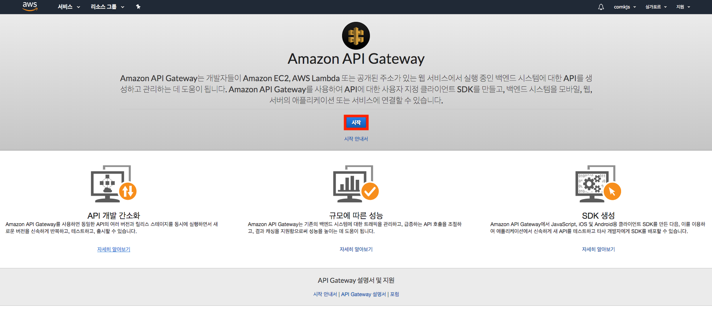

### 5.2.2 엔드포인트 유형 지정

- 엔드 포인트 유형

1. 지역 : 현재 리전에 배포
2. 최적화된 에지 : CloudFront 네트워크에 배포
3. 프라이빗 : VPC에서만 엑세스 가능

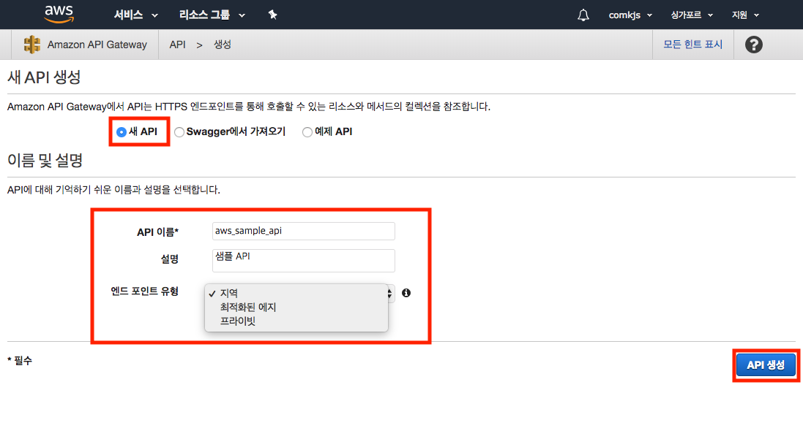

### 5.2.3 리소스 생성

> 리소스는 호출할 수 있는 특정 URL
>
> 리소스 경로에 `{}`가 포함되어 있으면 경로 파라미터를 나타냄. ( `{review-no}`)

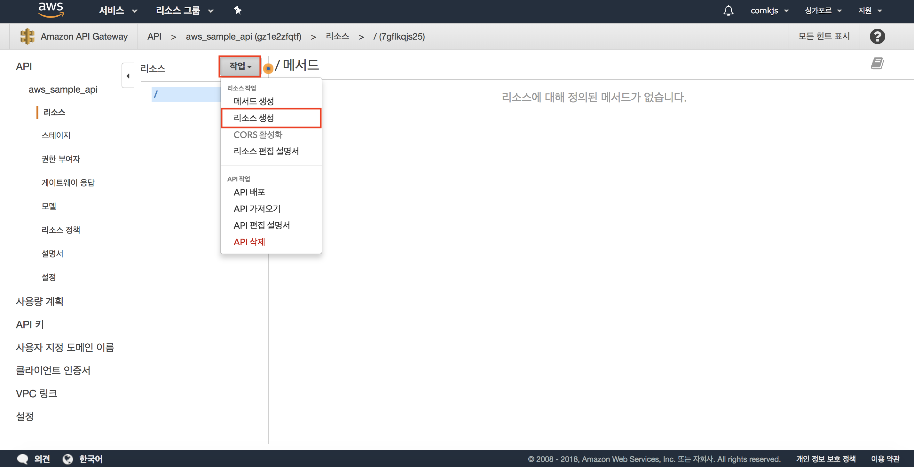

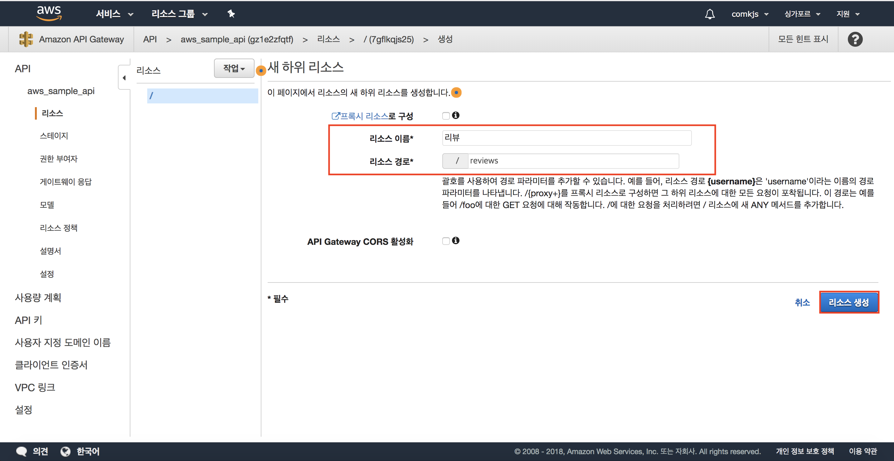

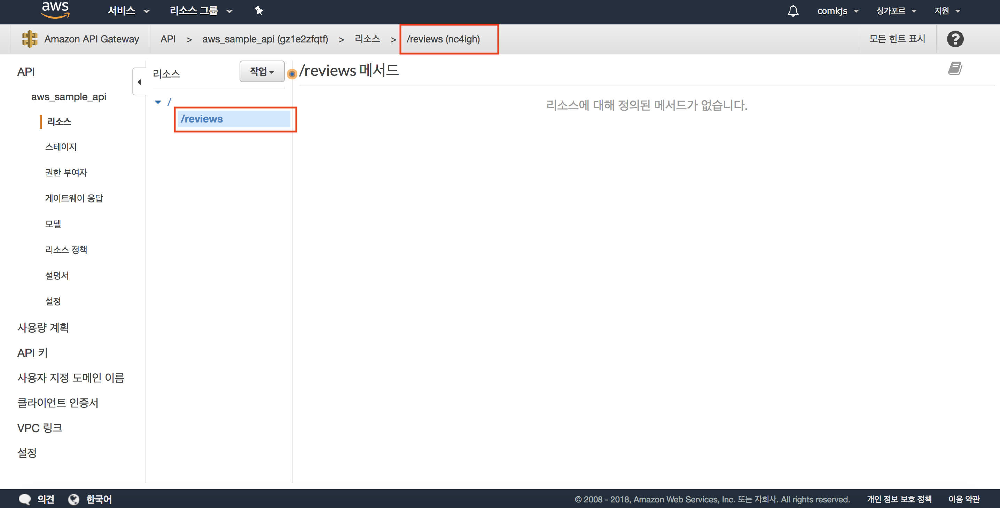

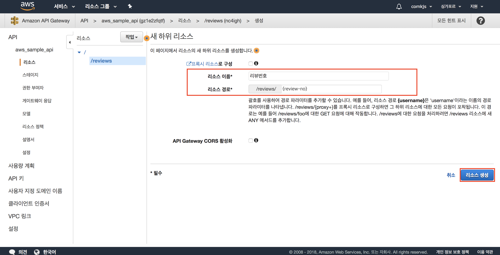

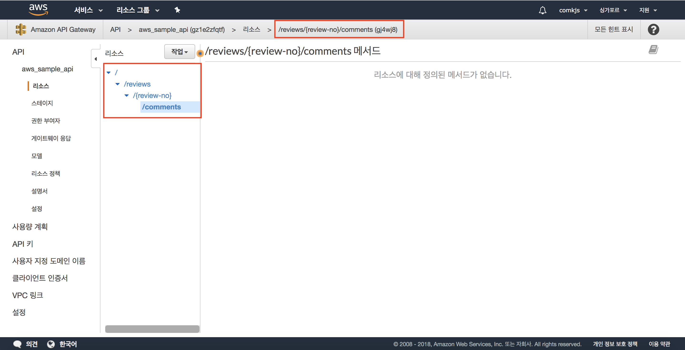

### 5.2.4  배포 - 스테이지 생성

> 스테이지 상세 정보에 API 호출 주소가 생성되게 됨.

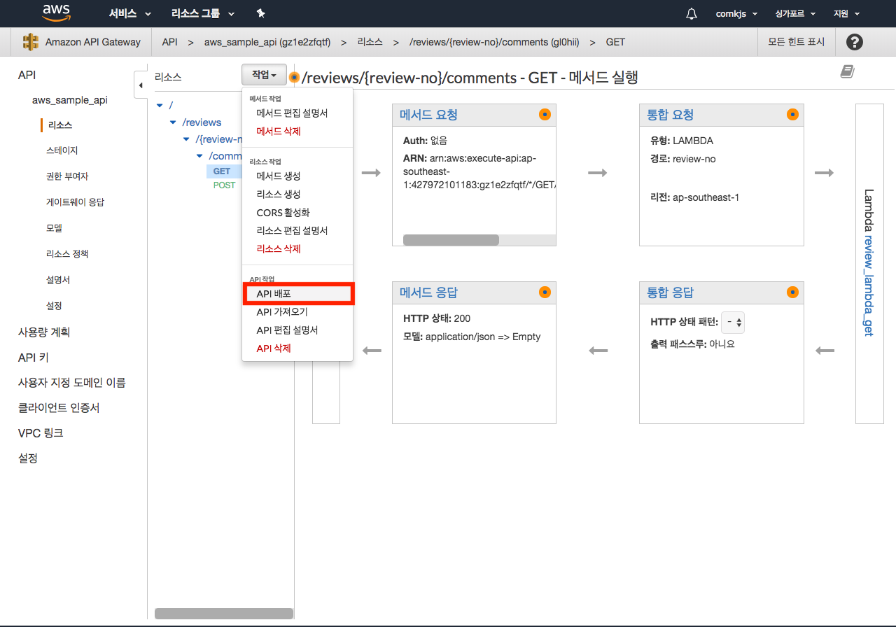

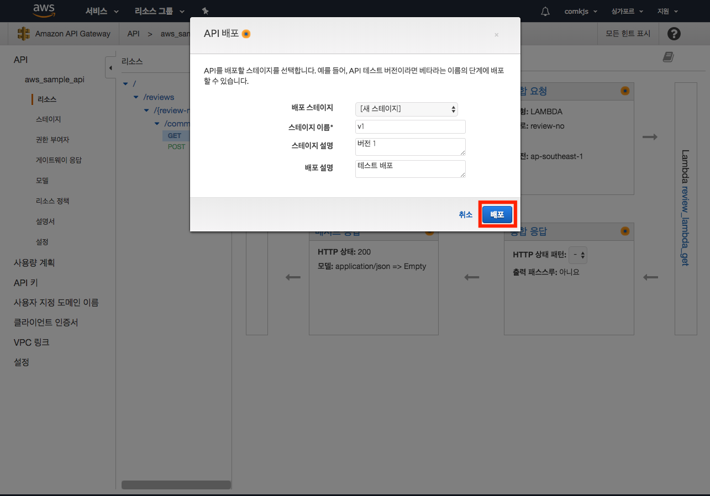

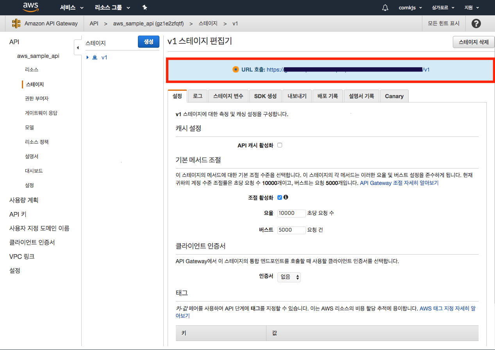

## 5.3 lambda 함수 생성

### 5.3.1 함수생성

https://us-east-2.console.aws.amazon.com/lambda/home?region=us-east-2#/functions

기존 역할 생성이 아니라 기본 Lambda 권한을 가진 새 역할 생성 으로

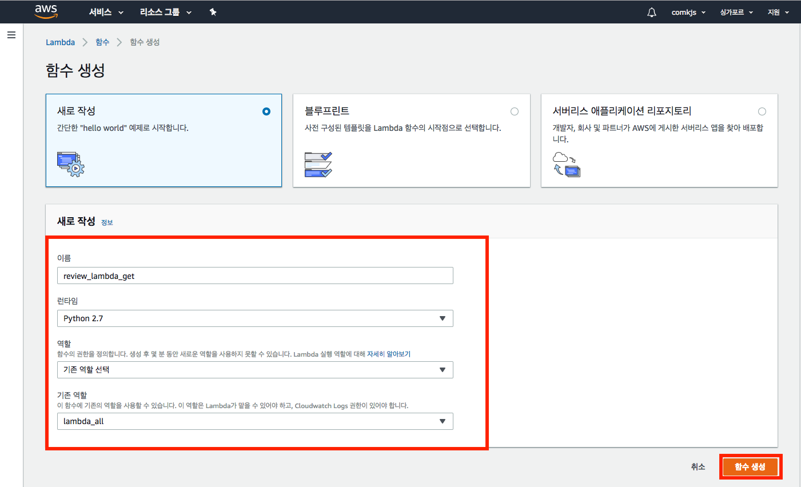

### 5.3.2 함수 로직 짜기

‘Hello from Lambda’ 문자열로 리턴되는 Lambda 함수가 생성

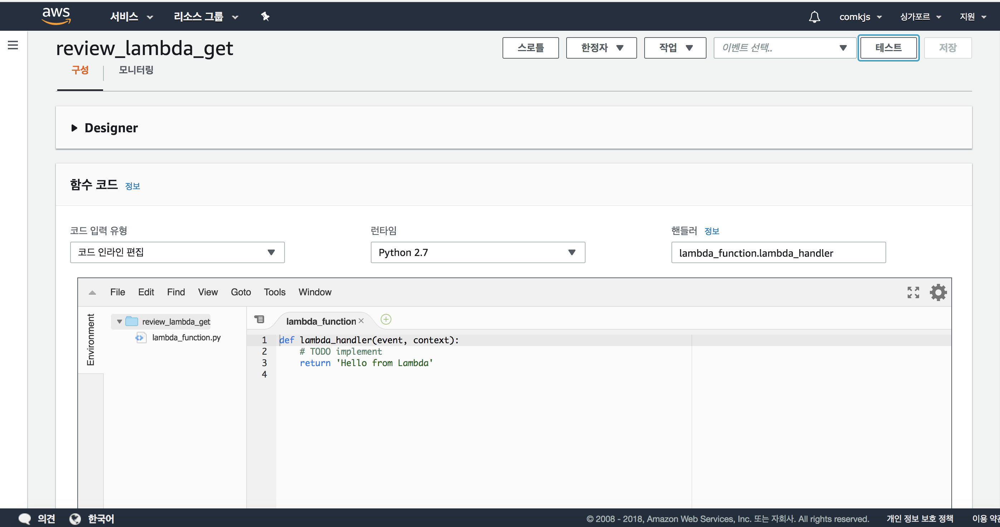


#### 5.3.2.1 lambda 코드를 배포하는 법

1. 인라인 편집기(간단한 코드의 경우 온라인에서 코딩하고 바로 실행) - 외부 라이브러리 사용 불가
2. zip파일 업로드( 50Mb 이하 외부 라이브러리 이용)
3. S3 (50Mb 이상 zip과 마찬가지)

#### 5.3.2.2 zip 파일 만들기

https://docs.aws.amazon.com/ko_kr/lambda/latest/dg/python-package.html

1. 사용 패키지 폴더에 설치하기

> pip install firebase-admin -t .

>  pip install lambdagram -t .

터미널 디렉토리 위치에 라이브러리를 설치해라 라는 의미로 해당 폴더의 하위폴더에 패키지들이 주르륵 깔린다.

2. 이 주르륵 깔린 패키지 파일들을 선택하여 하나의 zip 파일로 묶어준다.

3. .zip 파일 업로드를 선택하여 묶어준 zip 파일을 선택하여 업로드하다.

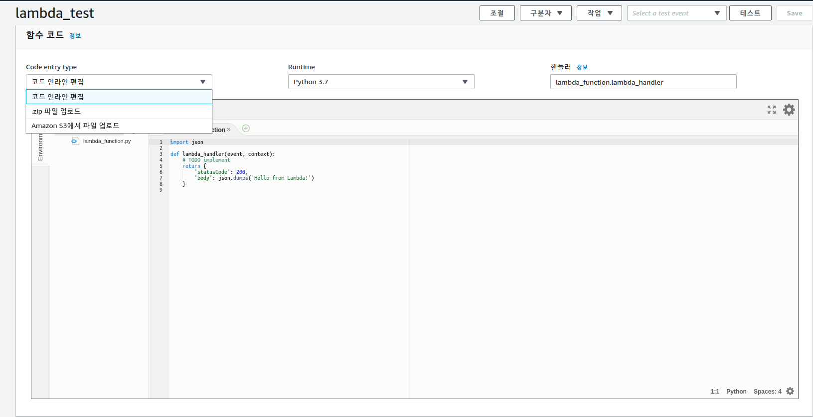

4. 업로드가 완료되면 파일 목록에 패키지 파일과 폴더들이 보이고, 그 이후에는 기존에 쓰던 것처럼 import를 통해 패키지를 사용하는 것이 가능하다.

(추가사항)

여기보면 lambda_function.lambda_handler 가 핸들러라고 되어있다.

zip 파일안에 내가 실행시킬 py의 이름을 lambda_function 이라고 파일 이름을 짓고

그 안에 lambda_handler 실행시킬 main 함수의 이름을 지어 놓으면 실행된다.

올리고 나서 상단의 테스트를 통해서 잘 실행이 되는지 확인해보면 좋다.

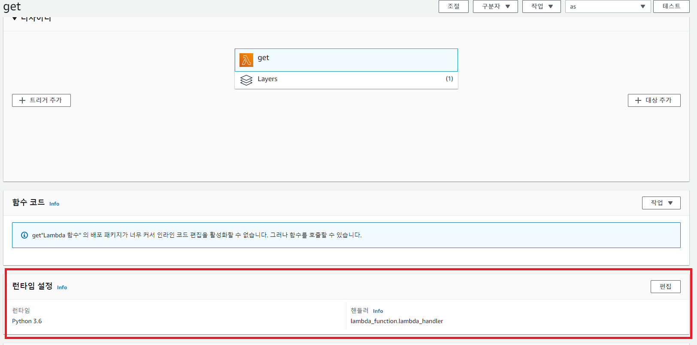


#### 5.3.2.3 Layer에 업로드 하는 방식(뭔가 에러남)

> 첫번째 방법은 다음과 같은 상황에서 문제를 겪는다.
>
> - 여러 함수에서 해당 패키지를 임포트하여 사용해야할 때
> - 올려야 할 패키지의 종류가 늘어나고 용량이 꽤나 커졌을 경우

Layer에 업로드하는 방법은 앞에서 언급한 문제들 중 여러 함수에서 공통으로 임포트해야할 때의 문제를 없애주며, 용량이 너무 커지지 않는다면 여러종류의 패키지를 올려야하는 문제도 어느정도 해결해준다. 

1. 이번에도 pip을 이용해 패키지를 폴더에 설치해준다.
2. 동일하게 압축하되 압축파일 아래에 `python이라는 폴더`를 만들어 압축해준다.
3. 람다함수 밑의 Layers를 클릭한다.

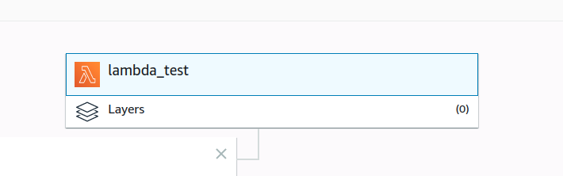

4. Add a Layer 클릭

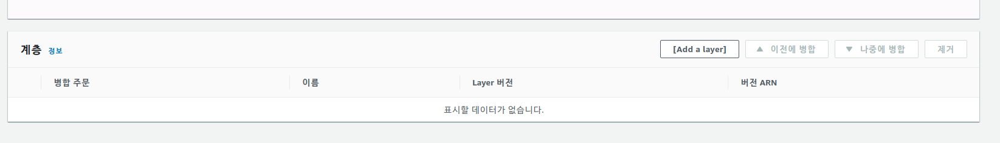

5. Layer를 먼저 생성해주어야 하기 때문에 계층을 먼저 클릭해준다.

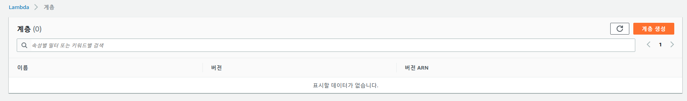

6. 계층 생성

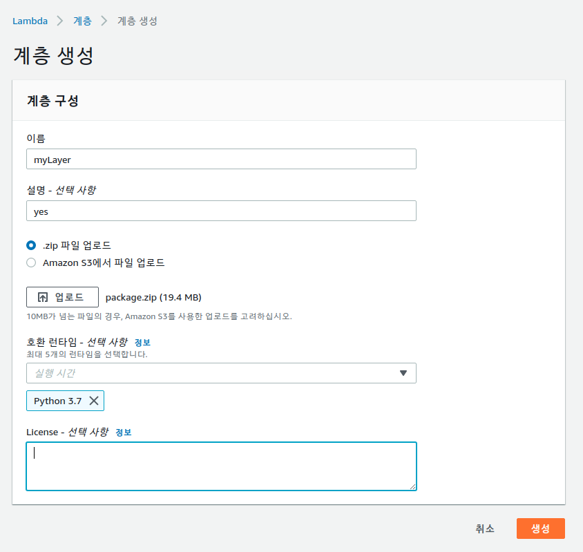

7. 이름, 설명, 런타임등 필요한 정보를 입력하고 만들어놓은 zip파일을 업로드한 후 생성을 누른다.

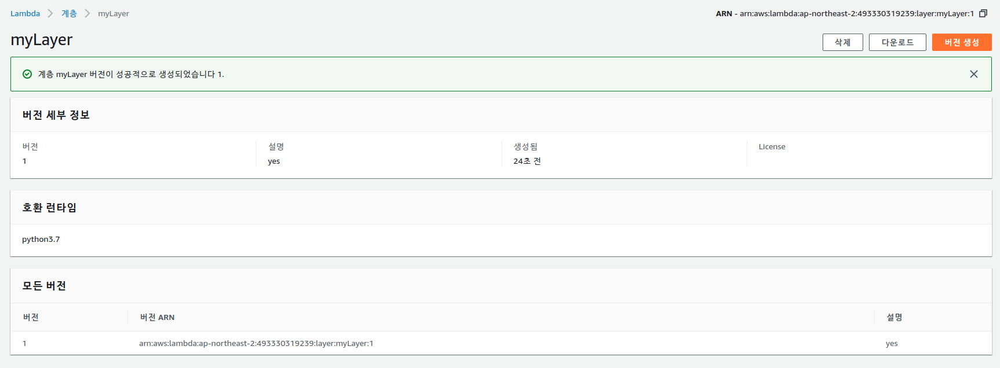

8.  Layer가 생성된 것을 확인 후 다시 람다함수의 Layer에서 Add a Layer를 선택해준다.

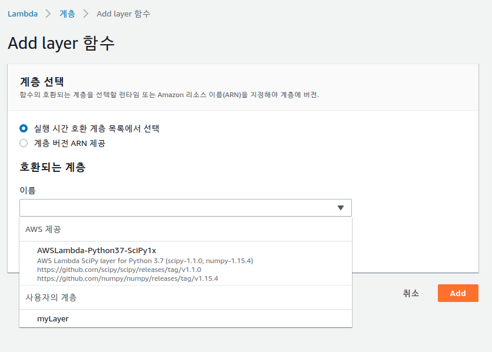

9. 방금 만든 myLayer를 선택해주고 버전은 처음이므로 하나 밖에 존재하지 않는다. 레이어에 변경사항이 있을때마다 버전이 늘어나는데 늘어나는 대로 최근 버전을 업로드해주면 된다.

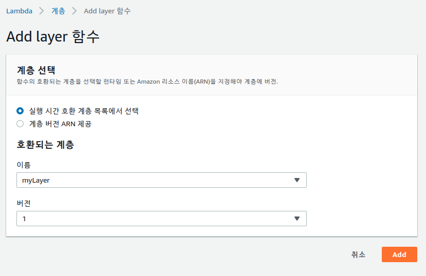

10. Layer 또한 변경사항 이기 때문에 저장

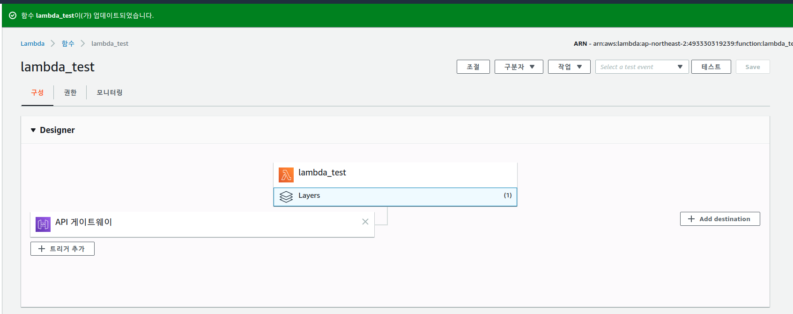

11. 레이어가 올라갔으니 코드에서 이와 같이 설치한 패키지들을 임포트하여 사용하는 것이 가능하다.

```python
import selenium
import requests
from mysql.connector import Errors
```


### 5.3.3 lambda_function.lambda_handler 메서드 구성

```python
def lambda_handler(event, context): # Basic function signature on AWS lambda 
    
    내용
    
    return log에 저장될 값
```

#### 5.3.3.1 event

> 사용자 요청에 대한 정보를 담고 있다.
>
> type은 딕셔너리이다.
>
> 아래는 텔레그램 봇을 만들 떄 POST 메시지로 보낸 요청을 lambda 함수가 받은 것이다.

```python
{
	'update_id': 439837311,
	'message': {
		'message_id': 13,
		'from': {
			'id': 93827364,
			'is_bot': False,
			'first_name': '홍길동',
			'username': 'honggildong',
			'language_code': 'ko-KR'
		},
		'chat': {
			'id': 93827364,
			'first_name': '홍길동',
			'username': 'honggildong',
			'type': 'private'
		},
		'date': 1520404199,
		'text': 'test message'
	}
}
```

#### 5.3.3.2 context

https://docs.aws.amazon.com/ko_kr/lambda/latest/dg/python-context.html

> 이 객체는 호출, 함수 및 실행 환경에 관한 정보를 제공하는 메서드 및 속성들을 제공한다.

## 5.4 웹훅

> 웹훅을 이용하면 getUpdates를 실시간으로 감시하지 않아도 메시지가 도착하면 텔레그램이 알려준다.

- 웹훅을 등록/해지 하는 주소

https://api.telegram.org/TOKEN/setWebhook

예시 :  https://api.telegram.org/bot1530673844:AAHGSlJ1c4C4DJsaKb2fu7IylEOLYusG87k/setWebhook

GET으로 호출하면 아래와 같은 메시지를 리턴하면서 웹훅이 해지되어있음을 알려준다.

```python
{"ok":true,"result":true,"description":"Webhook is already deleted"}
```

- 웹훅 등록하기

[https://api.telegram.org/bot${telegramBotToken}/setWebhook?url=${callbackURL}](https://api.telegram.org/bot/setWebhook?url=)

예시 : https://api.telegram.org/bot1530673844:AAHGSlJ1c4C4DJsaKb2fu7IylEOLYusG87k/setWebhook?url=https://qvdg68mk87.execute-api.us-east-1.amazonaws.com/corona_test/corona

${telegramBotToken}은 봇 token을 입력해 줍니다.
${callbackURL}은 Lambda함수와 연결되어 있는 APIGateway URL을 입력해 줍니다.

콜백받을 Amazon API Gateway 는 스테이지에 가면 호출 url을 알 수 있다.
내꺼 : https://qvdg68mk87.execute-api.us-east-1.amazonaws.com/

https://qvdg68mk87.execute-api.us-east-1.amazonaws.com/corona_testv3

성공적으로 등록 될 시 아래와 같이 출력된다.

```python
{"ok":true,"result":true,"description":"Webhook was set"}
```


- 웹훅 삭제하기

[https://api.telegram.org/bot${telegramBotToken}/setWebhook?url=](https://api.telegram.org/bot/setWebhook?url=)

${telegramBotToken}은 봇 token을 입력해 줍니다.
url을 비우면 웹훅 삭제가 됩니다.

```python
{"ok":true,"result":true,"description":"Webhook is already deleted"}
```


### 5.4.1 테스트하기

```json
#Test
{
	"update_id": 1544010213,
	"message": {
		"message_id": 13,
		"from": {
			"id": 1544010213,
			"is_bot": false,
			"first_name": "홍길동",
			"username": "honggildong",
			"language_code": "ko-KR"
		},
		"chat": {
			"id": 1544010213,
			"first_name": "홍길동",
			"last_name": "honggildong",
			"type": "private"
		},
		"date": 1520404199,
		"text": "test message"
	}
}
```

```python
#결과
event : {
    'update_id': 1544010213, 
    'message': {
        'message_id': 13, 
        'from': {
            'id': 1544010213, 
            'is_bot': False, 
            'first_name': '홍길동', 
            'username': 'honggildong', 
            'language_code': 
            'ko-KR'}, 
        'chat': {'id': 1544010213, 
                 'first_name': '홍길동', 
                 'username': 'honggildong', 
                 'type': 'private'}, 
        'date': 1520404199, 
        'text': 'test message'}
}    

context : <__main__.LambdaContext object at 0x7fe470448f60>"
```


# 5.5 AWS API GateWay와 lambda 연동

메서드 생성 > post 메서드 생성 (텔레그램에서 post방식으로 보냄) > 만들었던 lambda와 연동

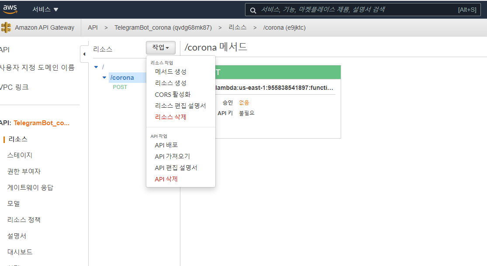

# 5.6 로그 확인하기

CloudWatch  > cloudWatch Logs > Log groups > 내가 만든 람다식 

을 확인해서 에러가 어디에서 났는지 확인 가능함


AWS 람다 공식문서

https://docs.aws.amazon.com/ko_kr/lambda/latest/dg/welcome.html
