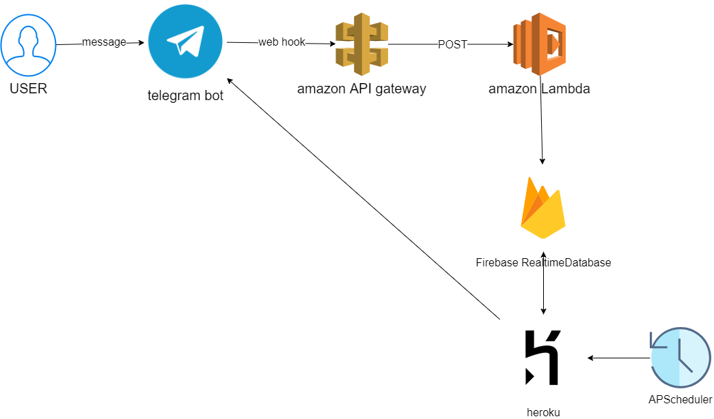

# 0. 텔레그램 봇 이름

seungwoon_bot1

# 1. 서비스 기능 

1. 봇에 대한 채팅 명령어에 따라 실시간 답변
2. 코로나 확진자 수 실시간 알림
   - 08:00 ~ 13:00 까지 6분 간격으로 질병관리본부 사이트를 크롤링하여 변경시 텔레그램에 알림

# 2. 서비스 구성

1. 텔레그램 봇 구성

   web hook을 활용하여, amazon API gateway 에서 그 신호를 받고 amazon Lambda를 실행하여 발생할 수 있는 요금을 최소화하여 구성

2. 데이터 베이스

   Firebase Realtime DataBase

   - 코로나 알림을 받을 사용자들 id, 전날 코로나 확진자수 내용 저장

3. 스케쥴 작업

   heroku 에서 APScheduler를 활용하여 특정시간에 함수가 작동할 수 있도록 구성

## 만든 방법 정리본

[howTomake.md](howTomake.md)

# 3. 고민한 사항

- telegram bot을 상시 활동상태로 만들기 위해 여러가지 방법이 있었다. 

  1. getUpdates()를 주기적으로 호출(loop) 하면서 새로운 메세지가 도착했는지 확인(teleport, python-telegram-bot 라이브러리 활용)

     프로그램 코드를 올릴 '서버'가 필요 - EC2 , 라즈베리파이, Digital Ocean같은 곳의 VPS 등

     - 단점 : 챗봇과 메세지를 주고 받을 때보다 안그럴 때가 많다면 자원 낭비가 심하다

  2. 웹훅 - 메시지가 도착했을 때 주소를 호출

     AWS API Gateway - 웹훅할 주소 생성 및 lambda 실행 연결

     AWS Lambda - 서버없이 서비스를 구현할 수 있도록 만든 서비스

     - 메시지가 도착했을 때만 실행 - 자원 낭비 최소화

# 4. 서비스 후 발생한 이슈

## 2021.01.22 

- 이슈

  - 증가확진자 수에 살짝의 오차가 있음

- 원인

  - 현재 증가 확진자 수 계산법

    = 이전 누적확진자 수 - 오늘 누적확진자 수

  - 질병관리본부 발표에서 각 지자체에서 정보를 받아 추합 후 발표자료를 내는데, 이전 자료에서 오차가 있을 경우 그 부분에 대해 수정을 하여 누적확진자 수를 발표함

- 해결

  - 증가확진자 수 계산 방식을 바꿈

    누적 확진자 수를 크롤링해올 때 증가확진자 수도  같이 크롤링하여 데이터 베이스에 계속 저장되어있도록 바꿈

## 2021.02.21

- 이슈

  - 9시에 1번, 9시 42분에 1번 정보가 전달됨

- 원인

  - 2021.02.20 에 특별발표로 오후 2시경에 비정규적으로 확진자 수에 대한 발표가 있었고 9시에 한 발표에 2명의 누적확진자가 증가했었음.

  - 9시(heroku 스케줄러 작동시작시간) - 전날 오후 2시에 대한 발표 전달

    9시 42분 - 2021.02.21 발표자료 전달

    을 했기 때문에 하루에 2번이나 알림이 오게됨

- 해결- 아직 안함

  - 오후 3시에 한번 정보를 전달하는 스케쥴러를 추가(?)
  - 해결방법이 딱히 애매